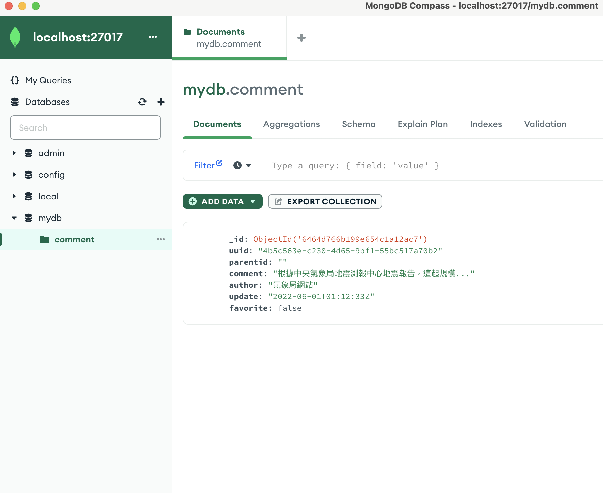

# quiz-1
使用技術：Golang、MongoDB、Docker 
1.先下載檔案下來後，在命令列輸入<b>「docker-compose up」</b> 
啟動API服務容器以及MongoDB容器  

2.看到服務啟動成功，此時我們目前API啟動服務位址是
http://localhost:8080  

3.使用MongoDB資料庫  
可以先在網路下載MongoDB Compass GUI https://www.mongodb.com/try/download/compass

4.MongoDB的連線位址 <b>「mongodb://localhost:27017/」</b> 

5.此時可以使用API服務，去建立comment 資料  
此專案中的api： 

1.POST /comment - 創建評論  
2.Get /comment/{uuid} - 取得單一評論  
3.Put /comment/{uuid} - 更新單一評論  
4.Delete /comment/{uuid} - 刪除單一評論  

資料格式為  
{  
    "parentid": "", - string  
    "comment": "根據中央氣象局地震測報中心地震報告，這起規模...", - string  
    "author": "氣象局網站", - string   
    "update": "2022-06-01T01:12:33Z", - string  
    "favorite": false - string - boolean  
}  

6.成功新增一筆資料後，可以前往剛剛的MongoDB Compass GUI 刷新，查看 mydb資料庫中的comment 
裡面就會顯示剛剛新增的資料 

